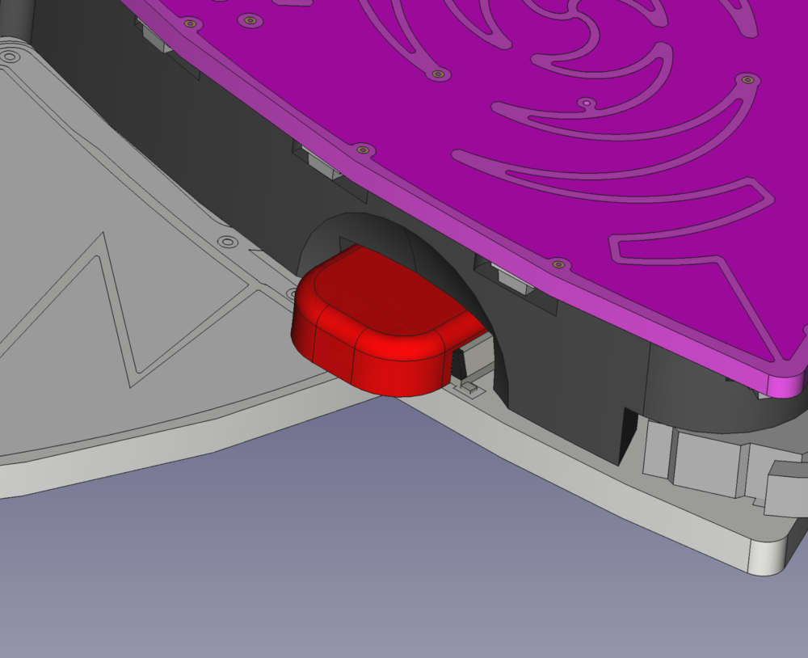
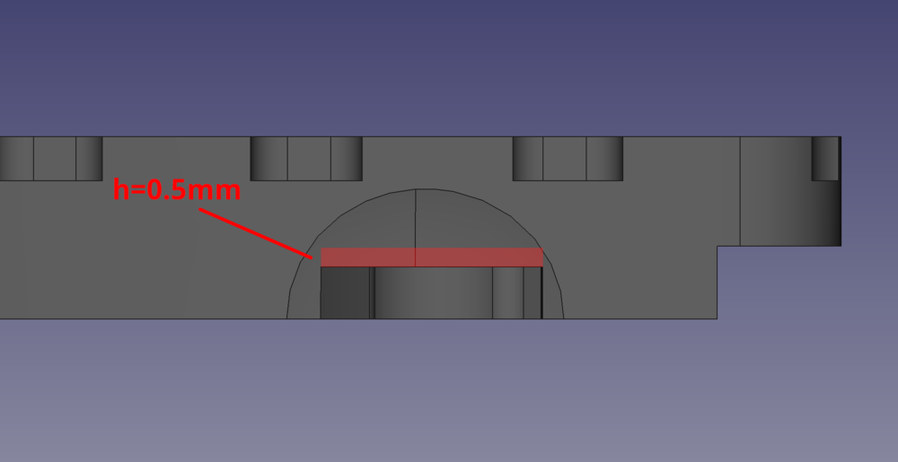
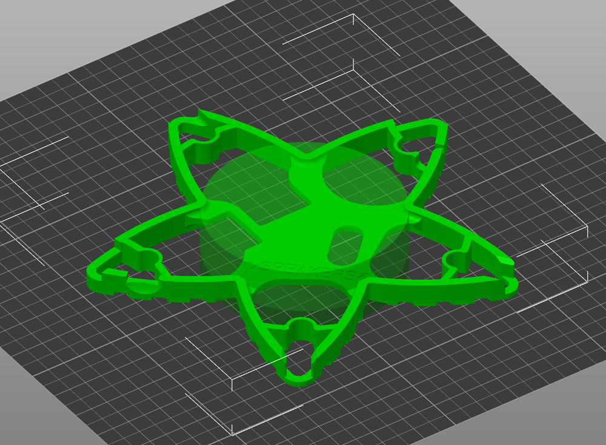

.. include:: <isonum.txt>

Modifications
=============

Documentation of some hardware modifications and addons for the badge.

Improved Power Switch
---------------------

With a few simple steps the Flow3rs power switch can be improved to protect it
from damage and make it easier operate.

1. Print switch cap
^^^^^^^^^^^^^^^^^^^

Download the `power_switch.stl <https://git.flow3r.garden/flow3r/flow3r-
hardware/-/raw/main/mechanical/STLs/power_switch.stl>`_ from the flow3r
hardware repo and print it on a 3d printer. The part is simple and does not
require special printer settings. On a regular FDM printer it should only take
a couple of minutes.

2a. Modify spacer
^^^^^^^^^^^^^^^^^

To make space for the printed switch the original spacer needs to modified.

Increase the height of the switch gap in the spacer by shaving of about 0.5mm
with an exacto knife or sand it of with the included piece of sand paper.

Remove the material marked red in the image:

2b. Alternative: Print New Spacer
^^^^^^^^^^^^^^^^^^^^^^^^^^^^^^^^^

There is also a new model of the spacer with a large enough gap for the switch
cap. The latest version can be downloaded from the project repository: 
`spacer.stl <https://git.flow3r.garden/flow3r/flow3r-hardware/-/raw/main/
mechanical/STLs/spacer.stl>`_

When printing on FDM best results can be archived by orienting the side with
the LED pockets towards the print bed and adding a cylindrical support enforcer
(d=55mm) for the central bracing with no other autogenerated support like this:

3. Assembly
^^^^^^^^^^^
Simply snap the printed switch cap onto the Flow3rs power switch and reassemble
the badge.
